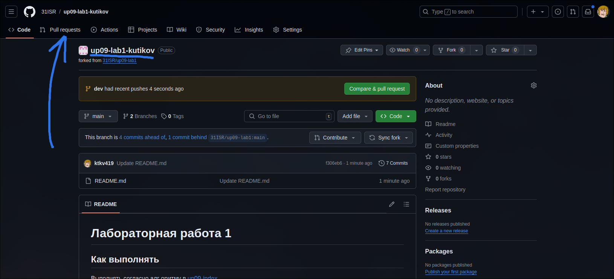
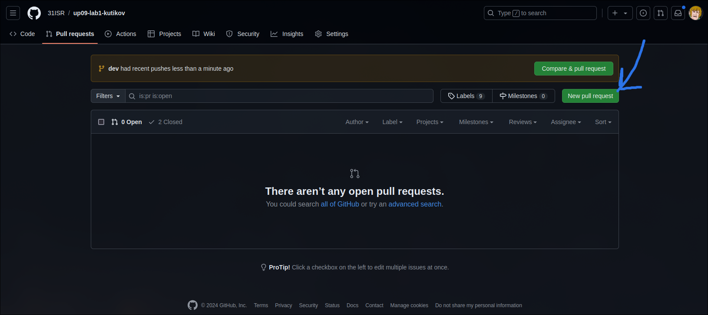
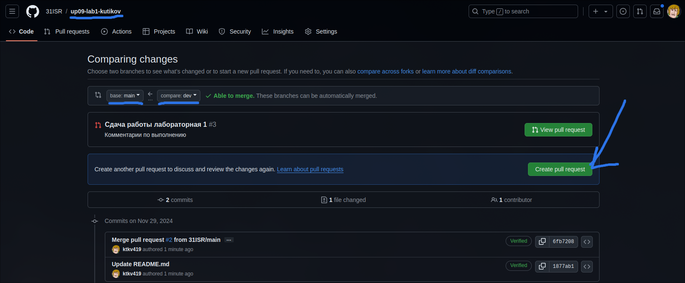
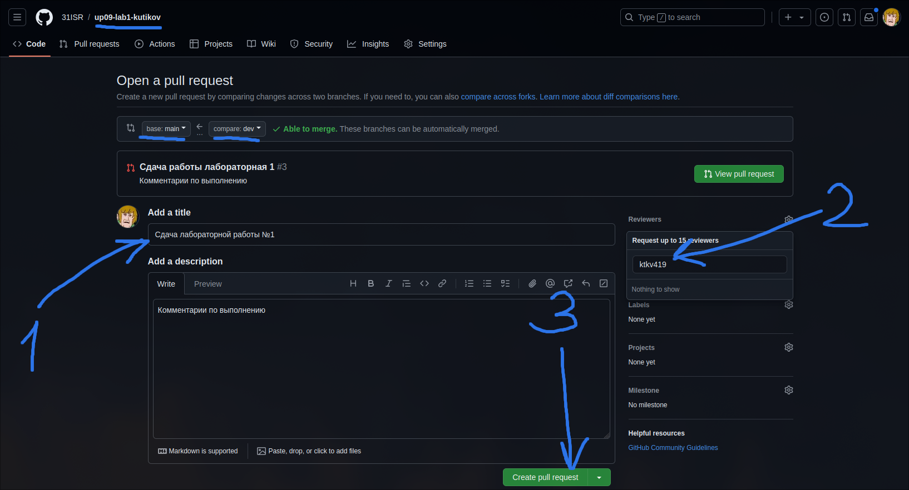

# Учебная практика 09

## Содержание

1. [Лидерборд](https://docs.google.com/spreadsheets/d/1KoJqEZ3I6PKSsAWVQLpNjRVCg3evXOI6E7fuSGsbhVY/edit?usp=sharing)
1. [Roadmap](#roadmap)
1. [Как выполнять задания](#как-выполнять-задания)
1. [Документация](#документация)
1. [Полезное](#полезное)

## Roadmap

Все, что находится выше `Мы здесь` должно быть у вас для успешного получения зачета

### 0. Vanilla JS интерактивность

[Лекция](https://ktkv-presentations.github.io/uidev-12/)
[Лабораторная работа №1](https://github.com/41ISR/webdev-1)

### 1. Работа с NPM пакетами
⬇ Мы здесь
[Лекция](https://ktkv-presentations.github.io/webdev-2/)
[Лабораторная работа №2](https://github.com/41ISR/webdev-2)

## Как выполнять задания

В каждом репозитории описано как выполнять задание. В случае, если не указано, то работать по следующему принципу:

### Как начать выполнять

1. Создайте fork репозитория в организации [41ISR](https://github.com/41ISR) под названием `webdev-{N}-{last_name}`
    - `N` - номер лабораторной работы
    - `last_name` - ваша фамилия
2. Переключитель на ветку `dev`
    - `git branch dev` - создать ветку (не надо писать, если ветка уже существует)
    - `git checkout dev` - переключиться на ветку `dev`
3. Выполняйте задания в ветке `dev`

### Как работать

1. Если были изменения в репозитории, то нужно стянуть последние изменения `git pull`
2. Выполняйте задания в ветке `dev`
3. Для отправки ветки `dev` на репозиторий GitHub необходимо:
    - Создать коммит `git add .` и `git commit -m "{Что делали}"`
    - Отправить коммит на GitHub `git push -u origin dev`

### Как сдавать

При успешном выполнении задания:

- Делайте коммит
- Добавляйте [pull request](#как-делать-pull-request) из `dev` в `main` в **вашем репозитории**
- Указывайте меня ([ktkv419](https://github.com/ktkv419)) как reviewer

При успешной сдаче задания pull request будет закрыт и последним сообщением перед закрытием реквеста будут написаны мои комментарии и оценка

### Как делать pull request

_Обратите внимание, что это делается в **вашем** репозитории, где вы работали_

1. Откройте вкладку Pull requests

    

2. Создайте новый PR

    

3. Перепроверье, что изменения сливаются из ветки `dev` (справа) в ветку `main` (слева) и создайте новый PR

    
    

В случае успешной сдачи работы вы увидите мои комментарии по поводу работы, оценку и что реквест был слит с веткой main

## Установка ПО

## Документация

- [Документация NPM](https://docs.npmjs.com/) [en]
- [Документация React](https://ru.legacy.reactjs.org/) [en]

## Полезное

- [Git шпаргалка](https://github.com/cyberspacedk/Git-commands)
